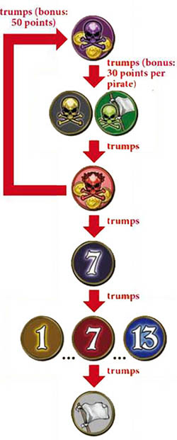
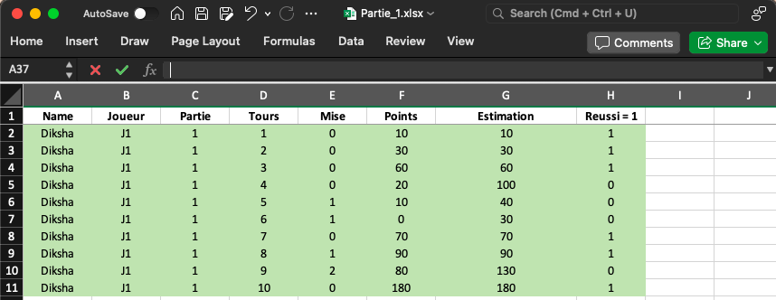
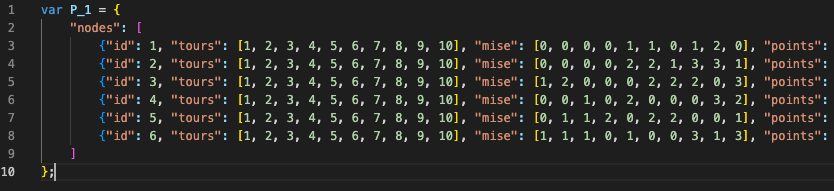

  

# Skull King Game analysis

This project is for players who have experience with or knowledge of Skull King. It consists of a basic interactive anaylsis of one game of 10 rounds with 6 players. By analyzing the game data and implementing new features, we can gain deeper insights into Skull King and enhance the game's appeal for players. Interactive analysis helps in understanding the game's dynamics and complexity. 

## Description of the game

Skull King is a strategic card game that combines the excitement of bid-taking with unique special cards and a pirate theme. Players must balance the risk and reward of their bids and use their cards wisely to outwit their opponents and win most points.

### Objective 
The goal of the game is to score the most points by correctly predicting the number of bids you will win each round.
Each round begins with a YoHoHo and the players place their bids.

### Scoring 
- If a player’s bid matches the number of wins:

  They score 20 points per bid
  Plus a bonus point in case of:
  
      - Winning a bid with the Skull King = 50 points
      - Catching the Mermaid with the Skull King = 30 points 

- If a player’s bid is incorrect:

  They lose 10 points for each bid they were off.

### End of the game
The player having the highest total points at the end of the 10th round is the winner and is titled the Captain!

## Data
Among the many games played with my friends, one game's scoring was chosen as the dataset for this project. 

The data was digitized into an Excel table:

Then converted into nodes and links in JavaScript format for network visualization:

Additionally, another JavaScript data file with a different structure was created for plot visualization:

Audio data???

## Tools
- D3.js: The coding for this project is done using D3.js, a powerful JavaScript library for producing dynamic, interactive data visualizations in web browsers. It utilizes HTML, SVG, and CSS to bring data to life through visual representation. For more information, feel free to consult their webpage: https://d3js.org/.
- Online Resources: Multiple websites were referenced for various parts of the coding process. The specific links to these resources are provided in the script.js file above the relevant sections of code.
- ChatGPT: Some parts of the code were generated using ChatGPT. Links to the conversations with ChatGPT are also included above the generated code for reference.
- User Feedback: The interactivity of the project was enhanced based on valuable inputs from users, leading to a more engaging and user-friendly experience.

## Overview of the webpage

Main interactive funcitons:

1- Audio message to welcome on the Skull King page.

- Has a message for the users when clicked on the "Climb aboard" button.
This functionality could be improved by having the audio played when the page is opened by a user. Another improvement would be to have the option to pause the audio as per will. 

2- An interactive slide bar, which contains a brief description of the game.

- slides in and out when the "Game rules" button is clicked
- Reminds the rules of the game

3- Network visualization to understand interactions between players.

- The players (nodes) can be moved
- In the processus of building the network, it came to light that the interactions between players are not proportional or interdependent hence the links provide limited information. 
- Heart of webpage : enables to activate the both the plots which provide more information on the rounds played and the evolution of the players over the game.

4- Plot dedicated to each round representing the points and bids made by the players.

5- Plot dedicated to each player's performance accross all the rounds.

Here is how the webpage looks with all the interaction active: or just photo? 

https://github.com/DikshaAcharya/Skull_King_Game_Analysis/assets/132992878/8e8a8582-a593-49c9-8a2a-e7b4fb2c9834

## To go further
Given the time constraints, this project will focus on one game and provide a basic representation of statistical analysis. However, a larger dataset would offer better insights of effective and ineffective strategies. Additionally, creating a risk index could evaluate different strategies, and adding features like a "YoHoHo" sound effect when a round is clicked could improve the user experience.

## Author
- Diksha Acharya
- Supervised by Isaac Pante
## Acknowledgement
- Player of the game
- professor for the supervision
- inputs from users
