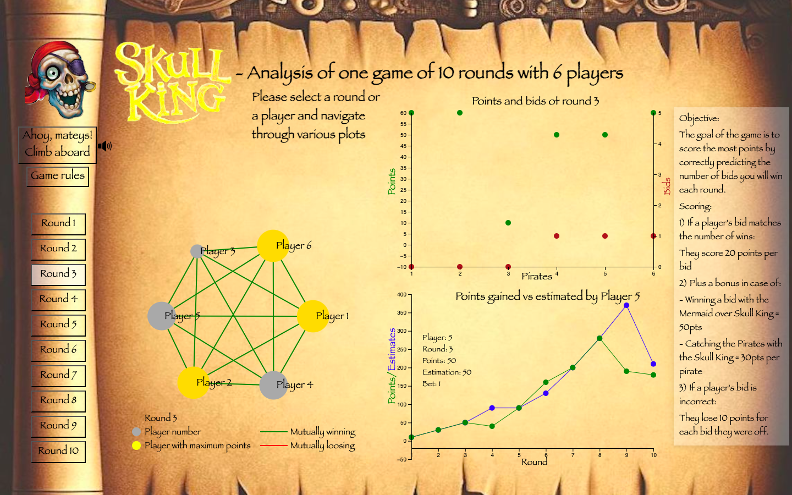

  

# Skull King Game analysis

This project is for players who have experience in playing or knowledge of Skull King game. This work consists of a basic interactive anaylsis of one game of 10 rounds with 6 players. By analyzing the game data, we can gain deeper insights into Skull King and enhance game's appeal for players. Interactive analysis helps in understanding the game's dynamic and complexity. 

## Description of the game

Skull King is a strategic card game that combines the excitement of biding with unique special cards and a pirate theme. Players must balance the risk and reward of their bids and use their cards wisely to outwit their opponents and win most points.

### Objective 
The goal of the game is to score the most points by correctly predicting the number of bids a player will win in each round.
Each round begins with a YoHoHo and the players place their bids using hand guestures.

### Scoring 
- If a player’s bid matches the number of wins:

  They score 20 points per bid plus a bonus point in case of:
  
      - Winning a bid with the Mermaid over Skull King = 50 points
      - Catching the pirates with the Skull King = 30 points per pirate 

- If a player’s bid is incorrect:

  They lose 10 points for each bid they were off.

### End of the game
The player having the highest total points at the end of the 10th round is the winner and is titled the Captain of the ship!

## Data
Among the many games played with my friends, one game's scoring was chosen as the dataset for this project. 

The data was digitized into an Excel table:

Then converted into nodes and links in JavaScript format for network visualization:

Additionally, another JavaScript data file with a different structure was created for plot visualization:

## Tools
- D3.js: The coding for this project is done using D3.js, a powerful JavaScript library for producing dynamic, interactive data visualizations in web browsers. It utilizes HTML, SVG, and CSS to bring data to life through visual representation. For more information, feel free to consult their webpage: https://d3js.org/.
- Online Resources: Multiple websites were referenced for various parts of the coding process. The specific links to these resources are provided in the script.js file above the relevant sections of code.
- ChatGPT: Some parts of the code were generated using ChatGPT. Links to the conversations with ChatGPT are also included above the generated code for reference.
- User Feedback: The interactivity of the project was enhanced based on valuable inputs from users, leading to a more engaging and user-friendly experience.

- initiale idea image??

## Overview of the webpage

Main interactive funcitons and visualizations:

1- Audio message to welcome on the Skull King page.

- Has a message for the users when clicked on the "Climb aboard" button.
This functionality could be improved by having the audio played when the page is opened by a user. Another improvement would be to have the option to pause the audio as per will. 

2- An interactive slide bar, which contains a brief description of the game.

- slides in and out when the "Game rules" button is clicked
- Reminds the rules of the game

3- Network visualization to understand interactions between players.

- Clicking on the round in the left bar will activate the network interaction.
- The players (nodes) can be moved.
- In the processus of building the network, it came to light that the interactions between players are not proportional or interdependent hence the links provide limited information. 
- Heart of webpage : enables to activate both the plots that provide more information of the rounds played and evolution of each player during the course of the game.

4- Plot of each of the round represents the bids placed and points scored by the players.

- Clicking on the round in the left bar will activate the biding and points plot.

5- Plot dedicated to each player's performance accross all the rounds.

- Clicking on a player in the network will activate player's performance plot
  
Here is how the webpage looks with all the interaction and visualization: 

https://github.com/DikshaAcharya/Skull_King_Game_Analysis/assets/132992878/9b46c13d-6f08-41f9-9a10-5437fd32fc08

## How to use

All the files can be downloaded on your laptop. By clicking the index.html file, the webpage will be opened in default browers. As this project was developed using chrome browser in full size-screen format. This would assure an optimal usage of the website.

## To go further
Given the time constraints, this project will focus on one game and provide a basic representation of statistical analysis. However, a larger dataset would offer better insights of effective and ineffective strategies. Additionally, creating a risk index could evaluate different strategies, and adding features like a "YoHoHo" sound effect when a round is clicked could improve the user experience.

## Author

This project was built by Diksha Acharya as part of the course on "Visualisation des données" in the University of Lausanne given by professor Isaac Pante. Date of the conclusion of the project: June 2024.

## Acknowledgement
A big thank you to the players of the Skull King Game for their participation and data, to the professor for invaluable supervision, and to the users for their constructive inputs. These contributions have been essential to in imporving this project. 
